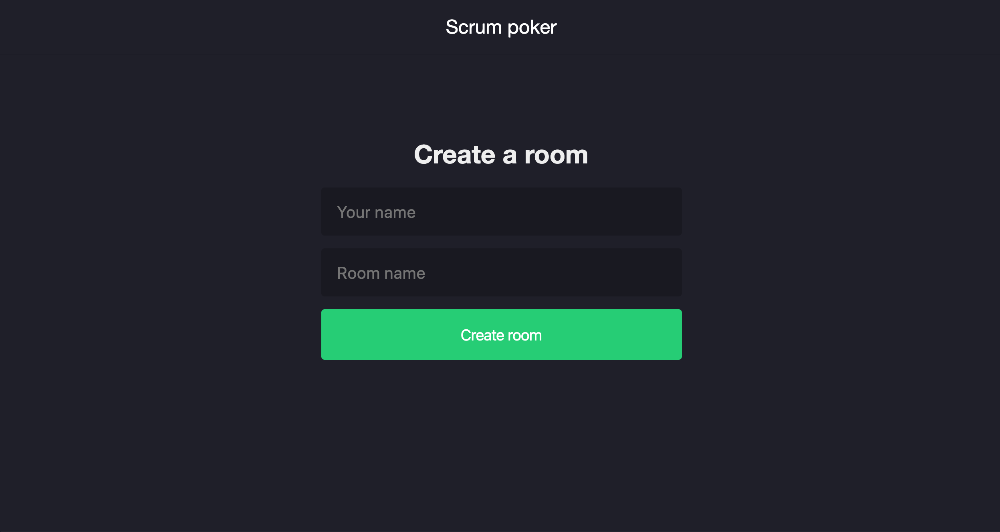
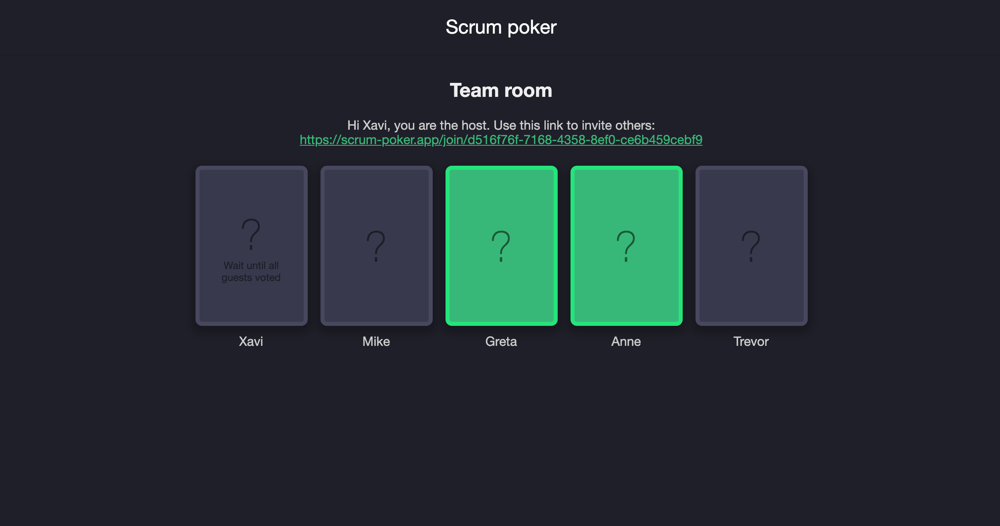
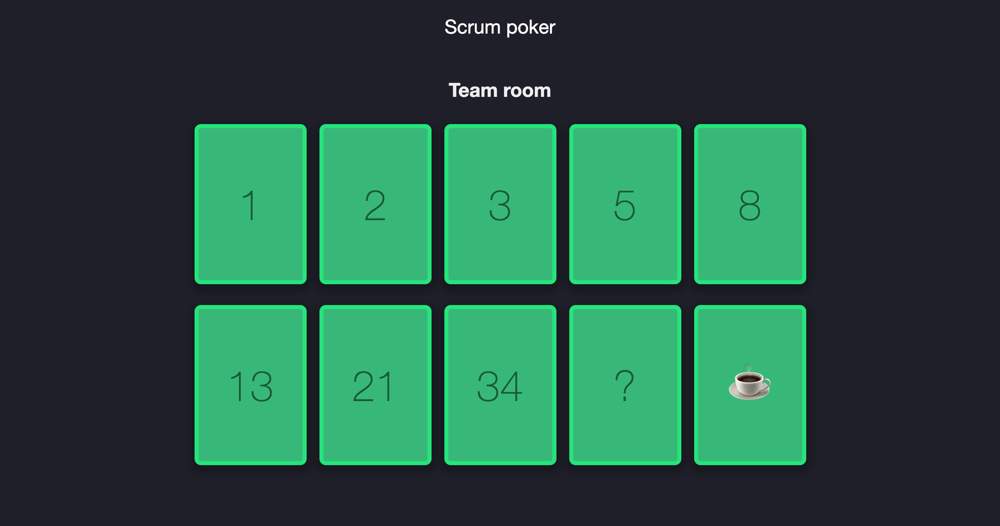
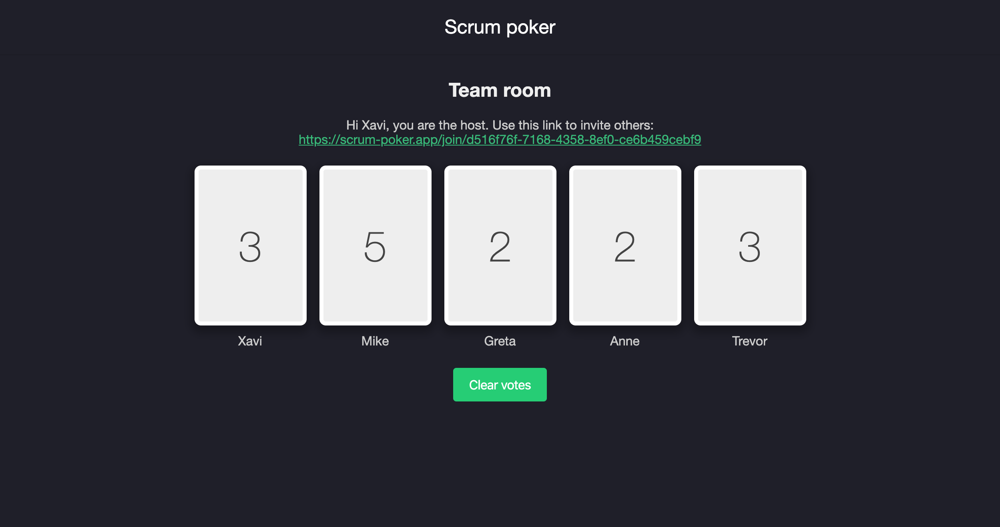

Realtime Scrum poker application to be used in remote sprint plannings. Built with [NextJS](https://nextjs.org/) and [Socket.IO](https://socket.io/).

## Live site

https://www.online-scrum-poker.com

## How to use it

Create a room, selecting the cards mode (either Fibonacci or T-shirt sizing).

In the host view, you can copy the link to share it with your teammates so they can join the room. Start the session and you'll start seeing their votes (green cards).

This is the guest view, where each of the room members will vote the current task. The host is the last one to see this view, the last to vote (must wait until all others did it).

Results! After agreeing on the final punctuation, clear the votes and another round will start.

